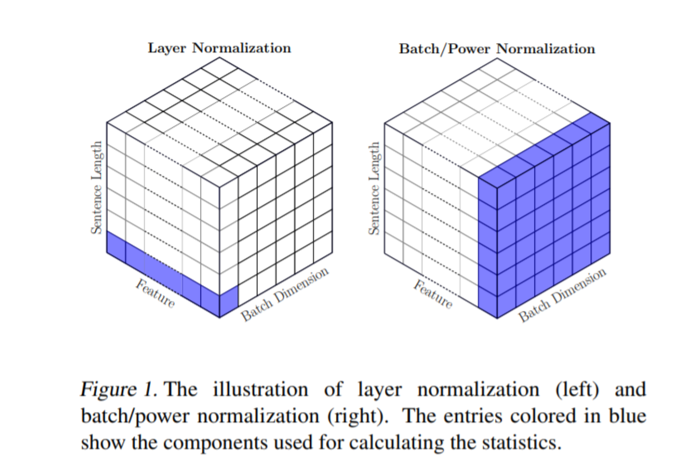
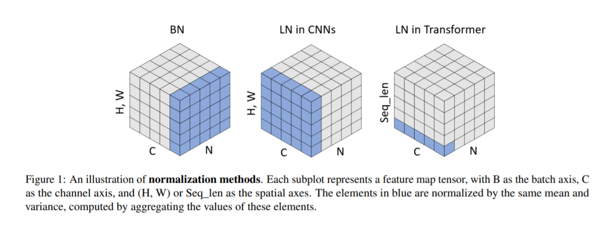
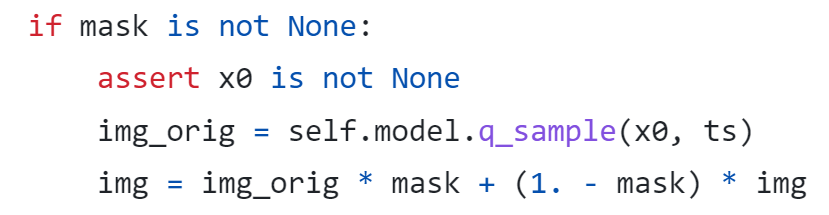
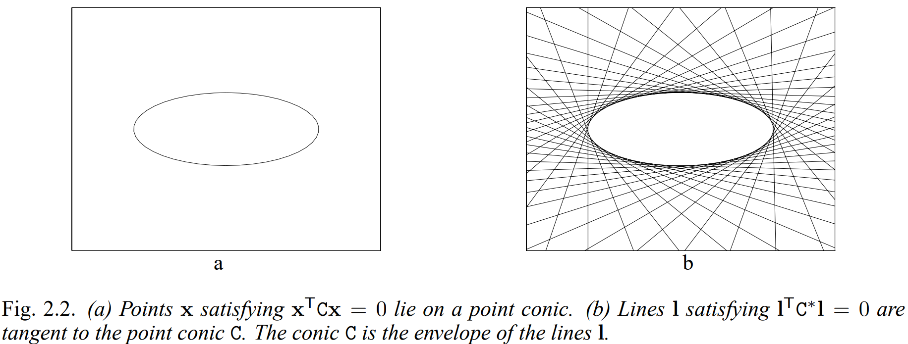

### Norm

*a* = [ [ [2, 3] ], [ [5, 7] ], [ [11, 13] ], [ [17, 19] ] ]
*b* = [ [ [0, 1] ], [ [1, 2] ], [ [3, 5] ], [ [8, 13] ] ]
c = [ [ [1, 2] ], [ [3, 4] ], [ [5, 6] ], [ [7, 8] ] ]

(N, C, H, W) = (3, 4, 1, 2)

#### Bacth norm

along N

#### Layer norm

along C

图片和序列数据处理不同

#### Instance norm

batchsize=1 or channel=1

#### Group norm

between IN and LN, split the channels into groups

### 数据集

#### CLEVR

### GeGLU激活函数

$$
GeGLU(x,W,V,b,c)=GELU(xW+b)\otimes(xV+c)
$$

### Controlnet inpaint

mask用高斯核进行模糊处理，使用cv2.INTER_AREA插值使得shape压缩到潜在维度，以便和潜在变量融合

在去噪的每个时间步数将采样得到的图片和当前噪音水平的噪音图片xt根据mask进行融合（减缓接缝痕迹）

### 硬核解读SD

https://developer.aliyun.com/search?q=%E7%A1%AC%E6%A0%B8%E8%A7%A3%E8%AF%BBStable+Diffusion&bizCategory=

## Projective geometry

### Conics and dual conics

The equation of a conic in inhomogeneous coordinates is
$$
ax^2+bxy+cy^2+dx+ey+f=0
$$
Homogenizing: x->x1/x3,  y->x2/x3
$$
ax_1^2+bx_1x_2+cx_2^2+dx_1x_3+ex_2x_3+fx_3^2=0
$$

$$
x^TCx=0
$$

$$
C = 
\begin{bmatrix}
a&b/2&d/2\\
b/2&c&e/2\\
d/2&e/2&f\\
\end{bmatrix}
$$

#### Five points define a conic

$$
ax_i^2+bx_iy_i+cy_i^2+dx_i+ey_i+f=0
$$

$$
\begin{pmatrix}
x_i^2&x_iy_i&y_i^2&x_i&y_i&1
\end{pmatrix}
c=0
$$

where $c=(a,b,c,d,e,f)^T$
$$
\begin{bmatrix}
x_1^2&x_1y_1&y_1^2&x_1&y_1&1\\
x_2^2&x_2y_2&y_2^2&x_2&y_2&1\\
x_3^2&x_3y_3&y_3^2&x_3&y_3&1\\
x_4^2&x_4y_4&y_4^2&x_4&y_4&1\\
x_5^2&x_5y_5&y_5^2&x_5&y_5&1\\
\end{bmatrix}c=0
$$
rank=5

#### Tangent lines to conics

> The line $l$ tangent to $C$ at a point $x$ on $C$ is given by $l=Cx$.

#### Dual conics

根据对偶性质，存在一个conic defined by line.
$$
l^TC^*l=0
$$

### Projective transformations

**Definition.** A *Projectivity* is an invertible mapping $h$ from $P^2$ to itself  such that three points $x_1, x_2, x_3$ lie on the same line if and only if $h(x_1), h(x_2), h(x_3)$ do.

#### Recovery of affine properties

transform $l_\infty$ to $(0,0,1)^T$ 

### torch

torch.Tensor.new_full

torch.Tensor.new_tensor = clone().detach()
