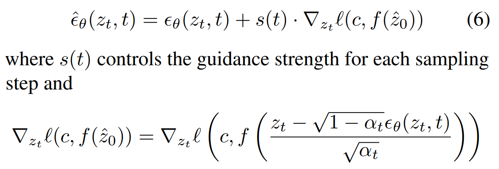
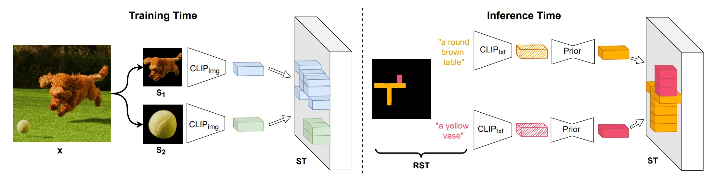
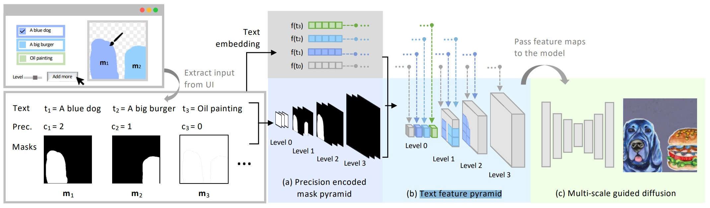
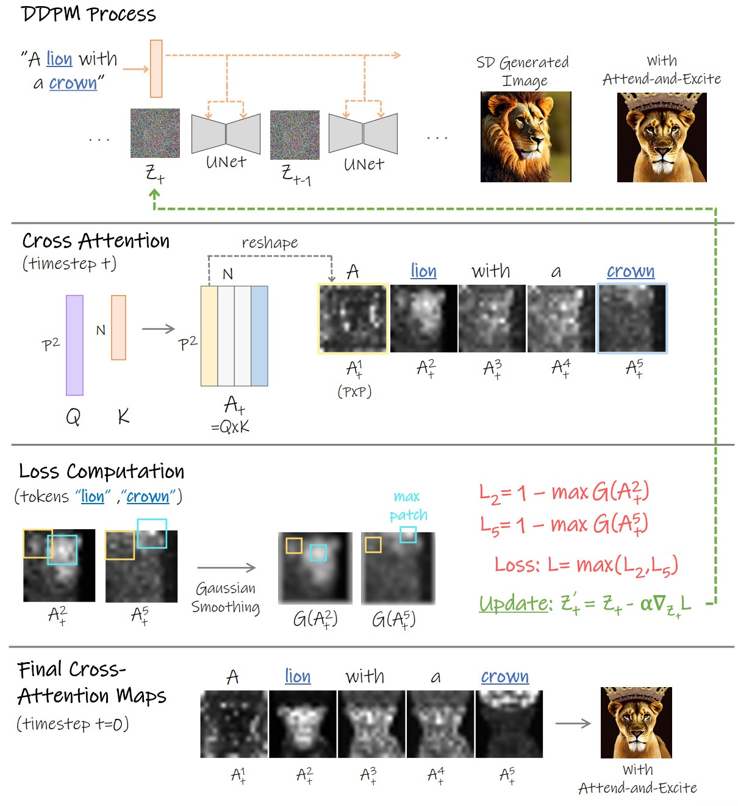
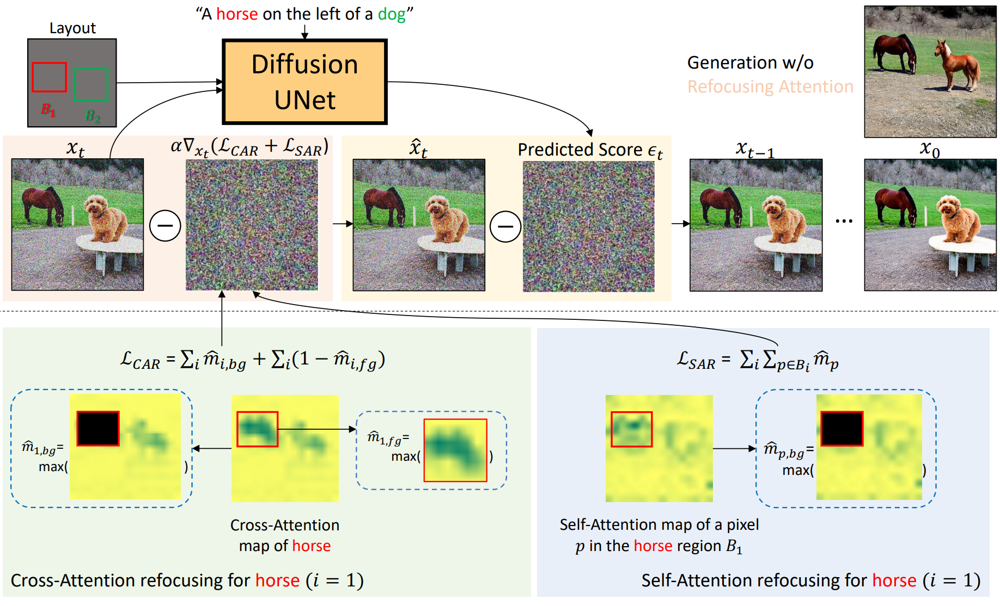
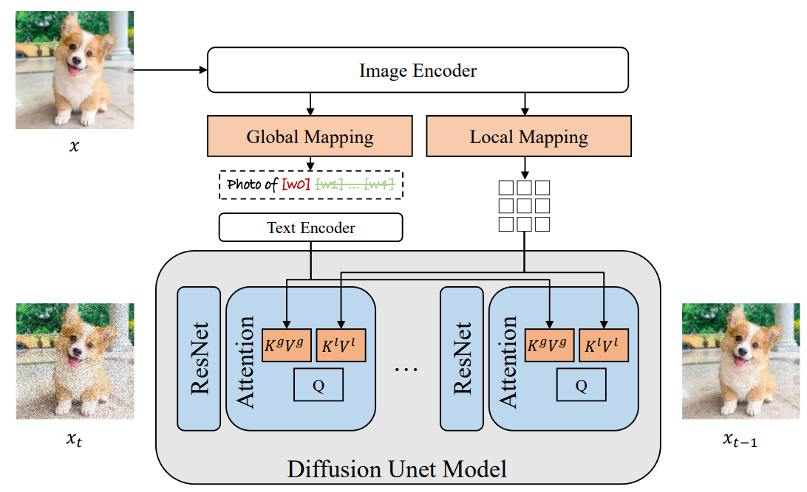
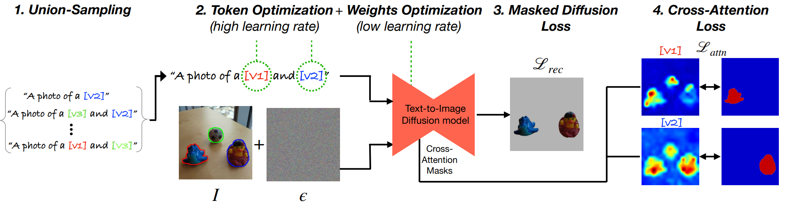
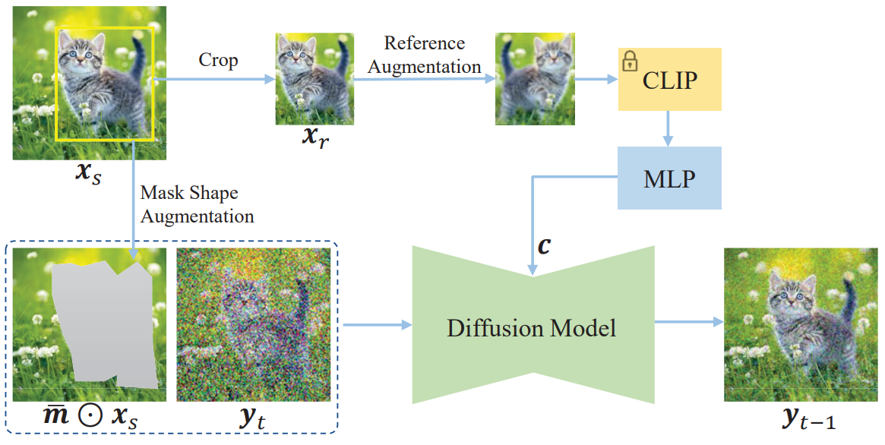
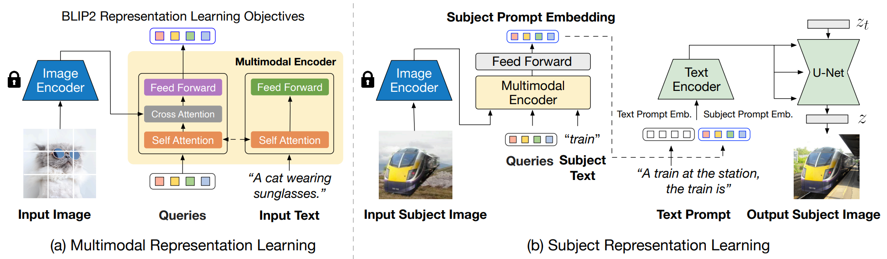

### 待读

Diffusion with Forward Models: Solving Stochastic Inverse Problems Without Direct Supervision

Seeing the World through Your Eyes

DreamEditor: Text-Driven 3D Scene Editing with Neural Fields

Differential Diffusion: Giving Each Pixel Its Strength

Visual Prompting via Image Inpainting

One for all: Generalized lora for PEFT

### Related Paper

#### Benchmarking Spatial Relationships in Text-to-Image Generation

​		一个benchmark

#### Training-Free Layout Control with Cross-Attention Guidance

​		输入有bounding box的位置图

​		两种方式，前向方式修改注意力权重，后向方式通过注意力权重backward到Zt

#### PosterLayout: A New Benchmark and Approach for Content-aware Visual-Textual Presentation Layout

​		生成Layout的方法，还没细看

#### DiffusionCLIP: Text-Guided Diffusion Models for Robust Image Manipulation

​		使用两个text间的clip距离引导生成图片与原始图片间的距离

#### CLIP-Adapter: Better Vision-Language Models with Feature Adapters

​		few-shot transfer learning like CoOp

#### Cones: Concept Neurons in Diffusion Models for Customized Generation

#### Nested Diffusion Processes for Anytime Image Generation

#### ReVersion: Diffusion-Based Relation Inversion from Images

### Controllable Generation

####  ReCo: Region-Controlled Text-to-Image Generation

​	text concat bounding box fune-tuning，没什么意思

####  GLIGEN: Open-Set Grounded Text-to-Image Generation

​	bounding box position concat在entity text之后形成grounding tokens, 在self attention和cross attention之间加一个gated self attention，其他参数都锁住

#### Universal Guidance for Diffusion Models

​	重要！推广classifier guidance，使用off-the-shelf guidance functions f, such as object detection or segmentation networks, 使classifier guidance可运用在任何任务

​	第一次提出forward 和 backward

#### Diagnostic Benchmark and Iterative Inpainting for Layout-Guided Image Generation

​	box内的物体一个一个的inpaint, 太蠢了

#### SpaText: Spatio-Textual Representation for Controllable Image Generation

​	训练一个特征表示

#### SceneComposer: Any-Level Semantic Image Synthesis

​	condition c变为一个Text feature pyramid, classifier-free 暴力训练

#### CONTROLLABLE IMAGE GENERATION VIA COLLAGE REPRESENTATIONS

使用GAN

fine-grained scene controllability through image **collages**  which allow a rich visual description of the desired scene

#### Collage Diffusion

1. Spatial fidelity through cross-attention manipulation:

​		modifies the text-image cross-attention with the layers’ alpha masks,
$$
Softmax(\frac{QK^T+w^{pos}A^{pos}-w^{neg}A^{neg}}{\sqrt{d}})V
$$
​		where $A^{pos}_{ij}=1$ if image token i correspondence to text token j, $A^{neg}$ contrary. $w$ proportion to $QK^T$

2. Appearance fidelity through textual inversion: 

​		text cannot capture fine-grained information, add a prefix prompt to text $(a, c)$ , use text inversion to train $a$ 

3. Controlling the Harmonization-Fidelity Tradeoff 

   add different noise to per-object

#### DiffCollage: Parallel Generation of Large Content with Diffusion Models

#### Composite Diffusion whole >= Σparts

text, layout, line art, pose, etc 组合起来 

#### UniControl: A Unified Diffusion Model for Controllable Visual Generation In the Wild

### Editing

####  EDICT: Exact Diffusion Inversion via Coupled Transformations

通过coupled transformation改善DDIM Inversion

#### Plug-and-Play Diffusion Features for Text-Driven Image-to-Image Translation

layout不变，只改变appearance, training-free

#### MasaCtrl: Tuning-Free Mutual Self-Attention Control for Consistent Image Synthesis and Editing

修改self-attention改变local structure

#### Diffusion Self-Guidance for Controllable Image Generation

google research出品，修改attention map和激活层

#### Continuous Layout Editing of Single Images with Diffusion Models

待读

#### LayerDiffusion: Layered Controlled Image Editing with Diffusion Models

需要提供背景和前景

#### Imagic: Text-Based Real Image Editing with Diffusion Models

#### Interpolating between Images with Diffusion Models

能否用在video上？

### Better Following Prompts

####  Training-Free Structured Diffusion Guidance for Compositional Text-to-Image Synthesis

composition diffusion. 使用**constituency tree**或**scene graph**, Parser划分名词短语。修改V键

#### Attend-and-Excite: Attention-Based Semantic Guidance for Text-to-Image Diffusion Models

使用高斯核Smooth Attention Maps

#### Grounded Text-to-Image Synthesis with Attention Refocusing

GPT-4 text-to-Layout

####  Aligning Text-to-Image Models using Human Feedback

####  Training Diffusion Models with Reinforcement Learning

####  ImageReward: Learning and Evaluating Human Preferences for Text-to-Image Generation

#### DPOK: Reinforcement Learning for Fine-tuning Text-to-Image Diffusion Models

####  Better Aligning Text-to-Image Models with Human Preference

### Concept Customization

#### Encoder-based Domain Tuning for Fast Personalization of Text-to-Image Models

Textual Inversion 的 word embedding space exhibits a **trade-off** between **reconstruction and editability**. This is because more accurate concept representations typically reside far from the real word embeddings, leading to poorer performance when using them in novel prompts. 

domain+offset

weight offsets

####  ELITE: Encoding Visual Concepts into Textual Embeddings for Customized Text-to-Image Generation

Global mapping 和 Local mapping.

single input image

global map concepts, local去除背景

#### Multi-Concept Customization of Text-to-Image Diffusion

多个concept customization

主要是加了Regularization dataset防止language drift

#### Break-A-Scene: Extracting Multiple Concepts from a Single Image

Single image input multiple concepts output.

####  Paint by Example: Exemplar-based Image Editing with Diffusion Models

#### BLIP-Diffusion: Pre-trained Subject Representation for Controllable Text-to-Image Generation and Editing

预训练

#### Unified Multi-Modal Latent Diffusion for Joint Subject and Text Conditional Image Generation

User-provided images may contain information irrelevant to the subject, such as complex backgrounds, poses, and lightning. The generation model has a high risk of overfitting to this redundant information and failing to generate new views required by the text.

Solution: **fusing sampling**

#### Subject-driven Text-to-Image Generation via Apprenticeship Learning

Apprenticeship Learning学徒学习

expert model

#### HyperDreamBooth: HyperNetworks for Fast Personalization of Text-to-Image Models

Google research

卖点：**25x** faster than DreamBooth and **125x** faster than Textual Inversion, using as few as **one** reference image, with the same quality and style diversity as DreamBooth. Tackle the problems of **size** and **speed** of DreamBooth, while preserving **model integrity, editability** and **subject fidelity**.

method: 

 1. *Ligntweight DreamBooth*: 进一步解耦lora权重

    $A = A_{aux}A_{train}$ with $A_{aux}\in R^{n\times a}$ and $A_{train}\in R^{a\times r}$ and

    $B=B_{train}B_{aux}$ with $B_{train}\in R^{r\times b}$ and $B_{aux}\in R^{b \times m}$

​		where $r<<min(n,m), a<n, b<m$  

​		$A_{aux},B_{aux}$  are randomly initialized with orthogonal row vectors with constant magnitude and frozen.

​		在lora的基础上进一步减少了训练的参数

 2. 使用HyperNetwork预测Ligntweight DreamBooth的残差矩阵

 3. Rank-Relaxed技术增加lora rank，目的: 

    > This expands the capability of our method of approximating **high-frequency details** of the subject, giving **higher subject fidelity** than methods that are locked to lower ranks of weight updates.

#### Encoder-based Domain Tuning for Fast Personalization of Text-to-Image Models

Single image. Accelerate training times to seconds.

Cons: need pretrain in single domain, can't generalize to other domain.

1. * Encoder inversion predict domain residual 

   ​              $$\epsilon_c=\epsilon_{domain}+s·E(I_c)$$ 

   * Encoder architecture.

     > We design our encoder as a set of featurerefinement blocks built on top of a pre-trained OpenCLIP ViT-H/14 feature-extraction backbone.

   * Iterative refinement

2. Learning Weight Offsets

3. Pretrain in domain data

4. Personalization funetuning

   

#### Domain-Agnostic Tuning-Encoder for Fast Personalization of Text-To-Image Models 

推广上一篇工作至多个domain

1. Hypernetwork predict lora residual
2. Embedding Regularization
   *  use of a "nearest-neighbor" contrastive-learning objective with dual goals: (1) push the predicted embedding close to their nearest CLIP tokens, and (2) map different concept images to different embeddings. 

3. Hyper-weights Regularization
   * Address overfit by hyper networks
   * Two path like controlnet. First path use original weight and nearest CLIP token, second path use this paper's method. Finally blend with a coefficient $\alpha_{blend}$

#### AnyDoor: Zero-shot Object-level Image Customization

综合了edit and customize, teleport any object to new scenes at specified locations in a harmonious way.

1. **ID token** replace text embedding c. Use self-supervised repretation extracted by DINO-V2

2. **Details maps** concat with Unet decoder feature.

   Fine-grained feature use high-feequancy map i.e. Sobel kernels. Stitch with scene background as Collage. Then send to a detail extractor. 

   Detail extractor is a controlnet style Unet encoder. 

3. **Data** use two frame in same video. 

   

## Video

#### Rerender A Video: Zero-Shot Text-Guided Video-to-Video Translation

待读

### Video Edit

#### TokenFlow: Consistent Diffusion Features for Consistent Video Editing

Training-free, enforcing consistency in the diffusion feature space.

1. DDIM inversion

2. Keyframe sample and joint editing

   Each frame queries all other keyframes and aggregates information from them.

3. Edit propagation via tokenflow

## 3D

#### DreamFusion: Text to 3D use 2D diffusion

use diffusion score update nerf parameters.

#### Novel view synthesis with diffusion models

pose condition image to image

Stochastic condition

## Diffusion Model Capabilities

### Zero-Shot Classifiers

#### Text-to-Image Diffusion Models are Zero-Shot Classifiers

assume a uniform prior, use diffusion score as likelihood

Improving Efficiency:

​		Share noise: use the same t across different classes

​		Candidate class pruning: discard implausible classes early  

Sota on shape/texture bias and attribute binding than CLIP

#### Your Diffusion Model is Secretly a Zero-Shot Classifier

### Visio-Linguistic Reasoning

#### Augmenting CLIP with Improved Visio-Linguistic Reasoning

Add a diffusion loss

Discriminative Diffusion Models as Few-shot Vision and Language Learners
