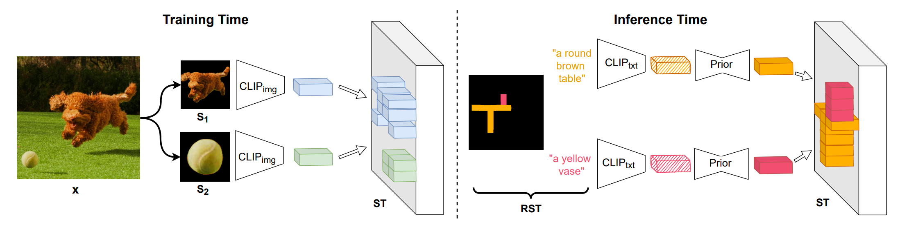
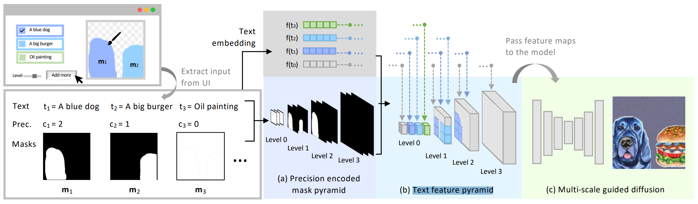
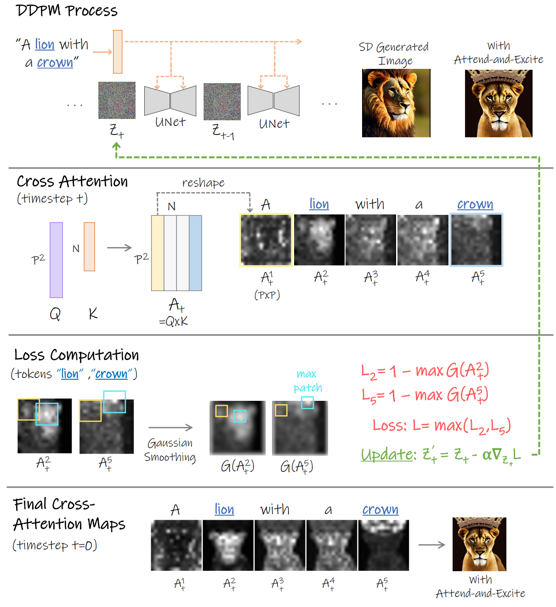
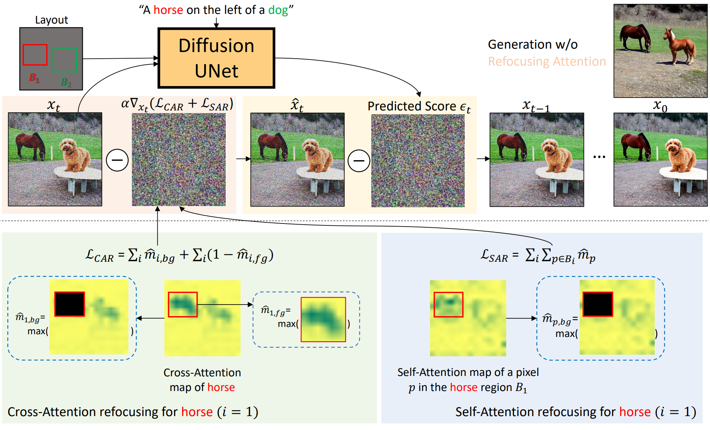
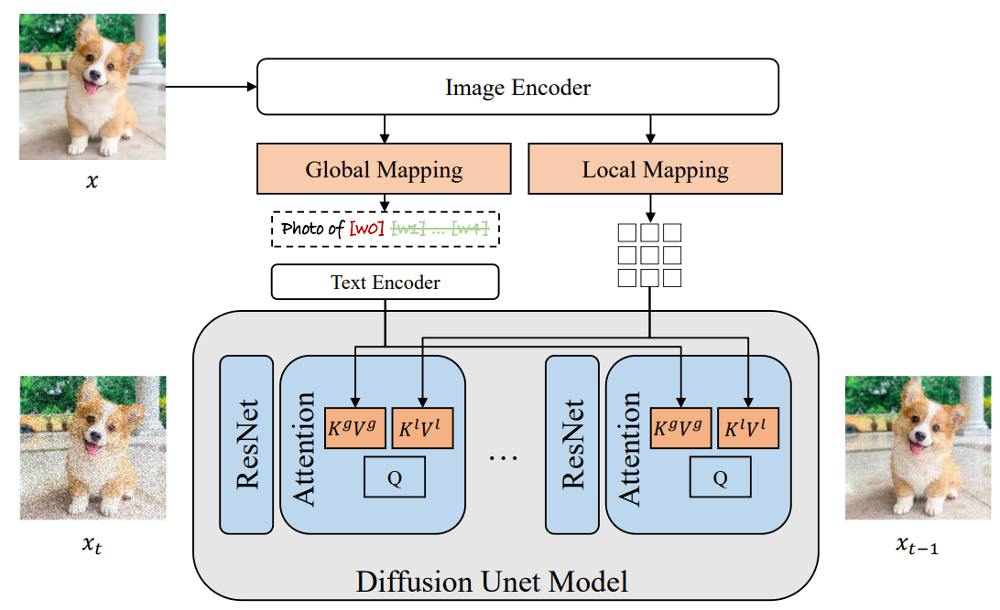
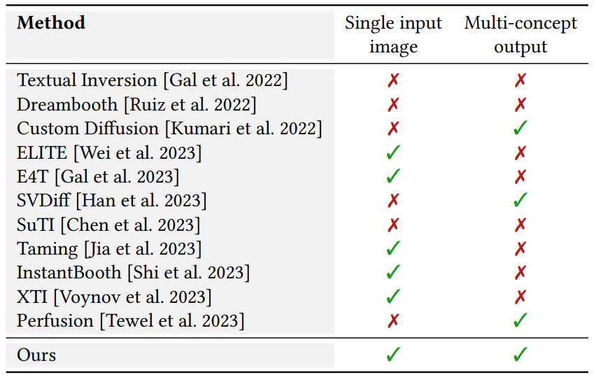
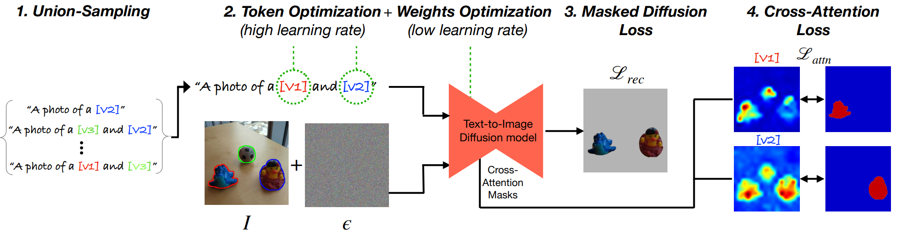
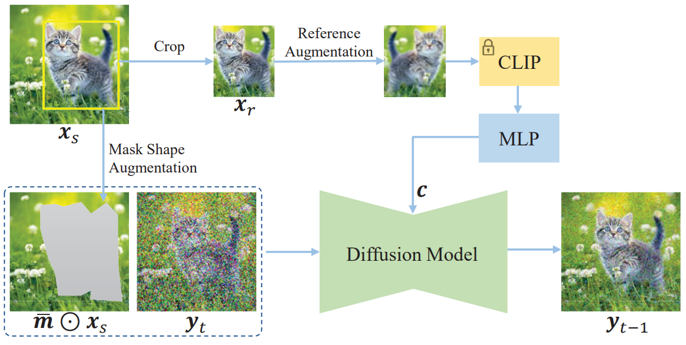

### Related Paper

#### Benchmarking Spatial Relationships in Text-to-Image Generation

​		一个benchmark

#### Training-Free Layout Control with Cross-Attention Guidance

​		输入有bounding box的位置图

​		两种方式，前向方式修改注意力权重，后向方式通过注意力权			重backward到Zt

#### PosterLayout: A New Benchmark and Approach for Content-aware Visual-Textual Presentation Layout

​		生成Layout的方法，还没细看

#### DiffusionCLIP: Text-Guided Diffusion Models for Robust Image Manipulation

​		使用两个text间的clip距离引导生成图片与原始图片间的距离

#### CLIP-Adapter: Better Vision-Language Models with Feature Adapters

​		few-shot transfer learning like CoOp

### Controllable Generation

####  ReCo: Region-Controlled Text-to-Image Generation

​	text concat bounding box fune-tuning，没什么意思

####  GLIGEN: Open-Set Grounded Text-to-Image Generation

​	concat在entity text之后形成grounding tokens, 在self attention和cross attention之间加一个gated self attention，其他参数都锁住

#### Universal Guidance for Diffusion Models

​	重要！推广classifier guidance，使用off-the-shelf guidance functions f, such as object detection or segmentation networks, 使classifier guidance可运用在任何任务

​	第一次提出forward 和 backward

#### Diagnostic Benchmark and Iterative Inpainting for Layout-Guided Image Generation

​	box内的物体一个一个的inpaint, 太蠢了

#### SpaText: Spatio-Textual Representation for Controllable Image Generation

​	训练一个特征表示

#### SceneComposer: Any-Level Semantic Image Synthesis

​	condition c变为一个Text feature pyramid, classifier-free 暴力训练

### Editing

####  EDICT: Exact Diffusion Inversion via Coupled Transformations

通过coupled transformation改善DDIM Inversion

#### Plug-and-Play Diffusion Features for Text-Driven Image-to-Image Translation

layout不变，只改变appearance, training-free

#### MasaCtrl: Tuning-Free Mutual Self-Attention Control for Consistent Image Synthesis and Editing

修改self-attention改变local structure

#### Diffusion Self-Guidance for Controllable Image Generation

google research出品，修改attention map和激活层

### Better Following Prompts

####  Training-Free Structured Diffusion Guidance for Compositional Text-to-Image Synthesis

composition diffusion. 使用**constituency tree**或**scene graph**, Parser划分名词短语。修改V键

#### Attend-and-Excite: Attention-Based Semantic Guidance for Text-to-Image Diffusion Models

使用高斯核Smooth Attention Maps

#### Grounded Text-to-Image Synthesis with Attention Refocusing

GPT-4 text-to-Layout

####  Aligning Text-to-Image Models using Human Feedback

####  Training Diffusion Models with Reinforcement Learning

####  ImageReward: Learning and Evaluating Human Preferences for Text-to-Image Generation

#### DPOK: Reinforcement Learning for Fine-tuning Text-to-Image Diffusion Models

####  Better Aligning Text-to-Image Models with Human Preference

### Concept Customization

#### Encoder-based Domain Tuning for Fast Personalization of Text-to-Image Models

Textual Inversion 的 word embedding space exhibits a **trade-off** between **reconstruction and editability**. This is because more accurate concept representations typically reside far from the real word embeddings, leading to poorer performance when using them in novel prompts. 

domain+offset

weight offsets

####  ELITE: Encoding Visual Concepts into Textual Embeddings for Customized Text-to-Image Generation

Global mapping 和 Local mapping.

single input image

global map concepts, local去除背景

#### Multi-Concept Customization of Text-to-Image Diffusion

多个concept customization

主要是加了Regularization dataset防止language drift

#### Break-A-Scene: Extracting Multiple Concepts from a Single Image

Single image input multiple concepts output.

####  Paint by Example: Exemplar-based Image Editing with Diffusion Models

#### BLIP-Diffusion: Pre-trained Subject Representation for Controllable Text-to-Image Generation and Editing

预训练

#### Unified Multi-Modal Latent Diffusion for Joint Subject and Text Conditional Image Generation

User-provided images may contain information irrelevant to the subject, such as complex backgrounds, poses, and lightning. The generation model has a high risk of overfitting to this redundant information and failing to generate new views required by the text.

Solution: **fusing sampling**

#### Subject-driven Text-to-Image Generation via Apprenticeship Learning

Apprenticeship Learning学徒学习

expert model
